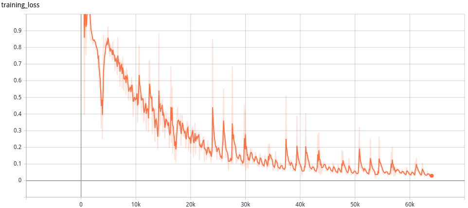

# path2vec

## Exp1
### 实验方式与参数配置
skip-gram + 负采样
- 10%的数据
- embedding dimension: 20
- Time window: 5s
- Sequence window: 40
- batch_size:256
- learning_rate:1.0
- epoch: 5

### 结果
训练集上的loss曲线

真实数据数量：90k batch?
训练速度缓慢

## Exp2
### threshold
按照不同文件夹级别划分
存在
```
0\11          1(*)

0\1\2\3\4\5   11
0\1\2\3\4\6   10
0\1\2\3\4\7   123
0\1\2\3\4\100 1(*)

0\1\2\3\4\5   1
0\1\2\3\4\6   1
0\1\2\3\4\7   2
0\1\2\3\4\100 1
=> 0\1\2\3\4\X
```
文件路径的预处理
分割为不同深度
0\X意味着在很少出现新文件的地方出现了
### Subsampling
根据出现频率调整采样率
### Position Weighting
随机取boundary.

## 训练速度问题
目前采用的数据采集方式，会导致产生的数据量巨大。

## 异常检测方式
以一分钟为单位切割数据，对每分钟的数据计算loss值，采用AUC值验证模型。
如何处理负采样？

## TODO
- [x] 测试集loss曲线
- [ ] 异常检测准确率方案
- [ ] 解决未登录词问题 [参考链接](https://www.zhihu.com/question/308543084) (fasttext)

# fasttext
fasttext处理问题的方式
- 每个word划分多个ngram
- ngram采用hash映射减少内存开销
- ngram均值作为vector
- input size: nword + hash bucket
- output size: nword
